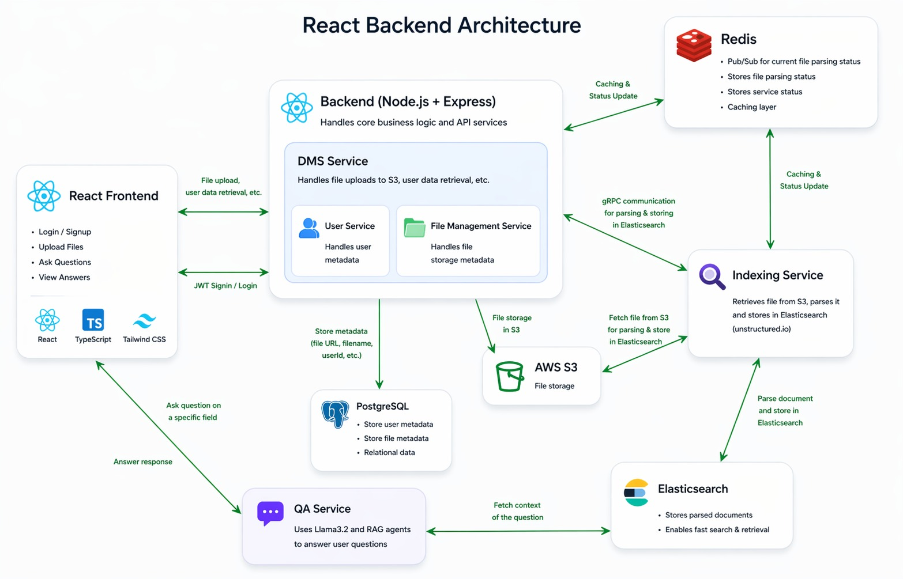
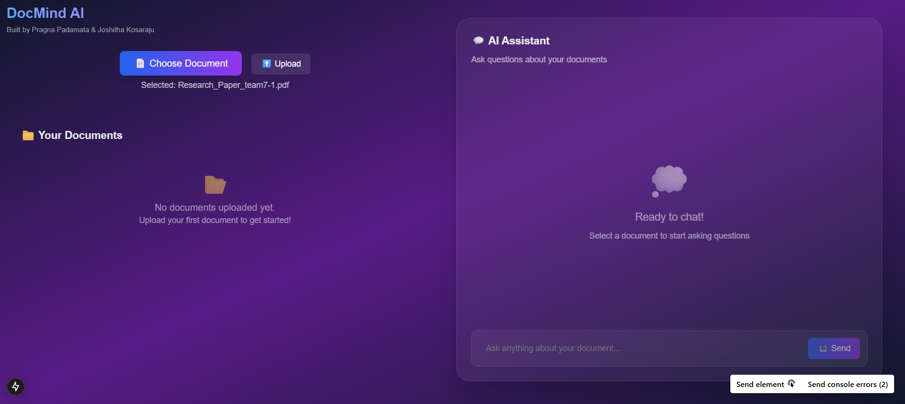

# Document Management and Query Application

## Overview

This project is a full-stack, microservices-based application designed to securely handle document uploads, parsing, indexing, and querying. It enables users to interact with various types of documents (PDF, PPT, CSV, etc.) through advanced natural language processing (NLP), leveraging RAG (Retrieve and Generate) agents for context-aware query responses. The application ensures high scalability, efficient processing, and secure access, making it suitable for enterprise-level use.

> Developed as a **2026 Major Project at BVRIT Hyderabad**, leveraging modern AI tools like **Anthropic Claude** and **Cursor IDE**.

---

## Features

- **User Authentication**: Secure login and registration using JWT tokens, ensuring user data protection.
- **Document Upload and Management**: Supports multiple file types with storage in AWS S3, allowing metadata tracking and categorization.
- **Advanced Document Parsing**: Utilizes `unstructured.io` to parse documents and extract meaningful metadata, making content easily retrievable.
- **NLP Querying with RAG Agents**: Implements RAG agents to generate accurate, context-sensitive answers to user queries based on document content, enhanced using **Anthropic Claude**.
- **Search and Indexing**: Uses Elasticsearch for indexing parsed content, enabling fast, efficient search capabilities.
- **Caching and Status Management**: Redis is used for caching document statuses and managing service health.
- **Logging and Monitoring**: Integrates with the ELK Stack (Elasticsearch, Logstash, Kibana) for centralized logging and supports Prometheus and Grafana for real-time monitoring.

## 🏗️ Architecture

  

## Technology Stack

- **Frontend**: React 18.2.0 with TypeScript
- **Backend Services**:
  - **NestJS** for Login and Document Management (DMS) services
  - **Flask** for Indexing and Query Answering (QA) services
- **Storage**: AWS S3 for file storage
- **Databases**: 
  - **PostgreSQL** for metadata storage
  - **Redis** for caching
- **Document Parsing**: `unstructured.io` for advanced parsing
- **NLP Processing**: LangChain/LlamaIndex and RAG agents (with **Anthropic Claude**)
- **Search Engine**: Elasticsearch
- **Containerization and Orchestration**: Docker and Kubernetes
- **Logging and Monitoring**: ELK Stack for logging, with optional Prometheus and Grafana for monitoring
- **Development Tools**: Cursor IDE (AI-assisted development)

## Architecture

The application follows a microservices architecture, with each service handling a distinct function, ensuring modularity, scalability, and fault tolerance. Services communicate over gRPC, REST APIs, and WebSockets as required. Each component is containerized using Docker and orchestrated with Kubernetes for deployment.

### Key Components

1. **Frontend**: Built with Next.js, providing a user-friendly interface for login, file upload, and query submission.
2. **Login Service**: Manages user authentication and authorization using NestJS and JWT.
3. **DMS (Document Management) Service**: Handles file uploads to AWS S3 and manages file metadata in PostgreSQL.
4. **Indexing Service**: Retrieves files from S3, parses content using `unstructured.io`, and indexes it in Elasticsearch.
5. **QA (Query Answering) Service**: Uses RAG agents to process user queries, retrieving and generating responses from indexed content using **Claude**.
6. **Caching and Status Management**: Redis is used to cache document processing status and manage inter-service communication.
7. **Logging and Monitoring**: ELK Stack is used for logging, with optional Prometheus and Grafana for application performance monitoring.

## Deployment

All services are containerized with Docker and managed with Kubernetes. The deployment supports scaling, load balancing, and high availability. Kubernetes manifests or Helm charts are provided to ease the deployment process on any Kubernetes platform (e.g., Minikube for local, AWS EKS for cloud).

## Documentation
https://island-wool-188.notion.site/AI-Planet-138e6e41cfdf803b98c8d10b6592a83d

### Key Deployment Features

- **Docker**: Each service has its own Dockerfile for containerization.
- **Kubernetes**: Manages the deployment, scaling, and orchestration of services.
- **Logging Sidecar**: A sidecar logging service is deployed with each container to aggregate logs centrally in the ELK Stack.
- **Optional Monitoring**: Prometheus and Grafana are configured to collect and visualize metrics, helping to monitor application health and performance.

## Getting Started

### Prerequisites

To set up and run this application, ensure you have the following installed:
- Docker
- Kubernetes (Minikube or cloud provider like AWS EKS, GKE)
- Redis
- PostgreSQL
- AWS S3 or an equivalent file storage solution
- Elasticsearch
- Node.js (for the frontend)

### Installation and Setup

1. **Clone the repository**: Download or clone this project from GitHub.
2. **Install dependencies**: Run `npm install` to install all required packages.
3. **Configure Environment Variables**: Update environment variables for AWS, PostgreSQL, Redis, and Elasticsearch.
4. **Build Docker Images**: Use the provided Dockerfiles to build images for each service.
5. **Start development server**: Run `npm start` to start the React development server.
6. **Open [http://localhost:3000](http://localhost:3000) in your browser to view the application.

## Usage

1. **Authentication**: Use the login service to create an account and sign in.
2. **Upload Documents**: Upload files in the supported formats (PDF, PPT, CSV, etc.) via the frontend.
3. **Query Documents**: Enter queries in natural language, and the application will fetch context-aware answers based on the document content.

## 💬 Chatbot Interface

  

## 👥 Contributors

- [Pragna Padamata](https://github.com/pragnapadamata)
- [Joshitha Kosaraju](https://github.com/KosarajuJoshitha)

## Contributing

Contributions are welcome! Please open an issue or submit a pull request for any improvements, bug fixes, or feature suggestions.

## License

This project is licensed under the MIT License.

---
